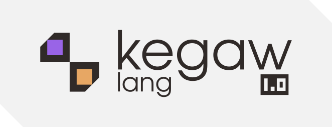

# kegaw language

kegaw lang is a compiled educational programming language.

this is a python compiler that transpiles kegaw scripts to c and generates a standalone compiled binary. the main distinguishing feature of this language is its dynamic syntax, where you can modify the appearance of the syntax. it supports modular shards, math, functions, custom aliases, direct c injection and automatic memory integrity(compile-time raii-like).

gcc or mingw is required

## usage

to compile a project:
`kegaw <project_directory>`

options:
`-o <name>` specify output binary name (default is app)
`-keepc` keep c source (default is keep only compiled bin)

## local installation

1. create a virtual environment:
python -m venv .venv

2. activate it:
source .venv/bin/activate (bash/zsh)
source .venv/bin/activate.fish (fish)

3. install requirements:
pip install pyinstaller
pip install -e .

4. generate the executable:
pyinstaller --onefile --console --name kegaw __main__.py

the binary will be in the dist/ folder.

## project structure

- main.keg: the entry point of your program.
- kegaw.kako: configuration file for syntax, paths, and aliases.
- shards/: directory for libraries and modules.

## syntax basics

in the default syntax style, statements must end with a dot.
scopes start with : and end with ;.

### variables
declare variables using the `@var` keyword followed by `#` and the type.
`@var#string name.`
`@var#int age.`

assign values using `<-`.
`name <- "sam".`
`age <- 25.`

### output
use `@log` to print to stdout.
`@log <"hello world">.`
`@log <name>.`

for no newline, use the `#flow` flag:
`@log <"loading: ", #flow>.`

### input
use `@talk` to get string input from the user.
`name <- @talk<>.`

### control flow

conditions use `@depends`.

```
@depends <age >= 18> :
    @log <"adult">.
;
```

loops use `@while`.

```
@while <x < 10> :
    x <- x + 1.
;
```

### functions

define functions with `@name <args> : scope ;`.

```
@sum <int a, int b> :
    return a + b.
;
```

the main entry point must be `@a <> : scope ;`.

## modularity and shards

import files from the shards directory using `@use`.
subdirectories are accessed using # instead of /.
`@use math#utils`.

if math/utils.kako exists, its functions become available.

## builtins and c integration

import internal features with ^.
```
@use ^talk.
@use ^terminal.
@use ^runc.
```

- `@terminal <"ls -la">.` : runs a system command.
- `@runc <"printf('hi');">.` : injects raw c code directly.
- `@trans <#int, string_var>.` : converts string to int (atoi) or float (atof).

## configuration (kegaw.kako)

you can customize the language behavior in `kegaw.kako`.

```
@syntax@
    SCOPE_START :
    SCOPE_END ;
    ARGS_START <
    ARGS_END >
    SENTENCE_END .
    ASSIGN <-
    FUNC_START @
    COMMENT ~~~
@/syntax@

@paths@
    SHARDS_PATH shards
    BUILD_PATH build
@/paths@

@aka@
    drawer var
    print log
@/aka@
```

the aka section allows you to rename any internal keyword to your preference.